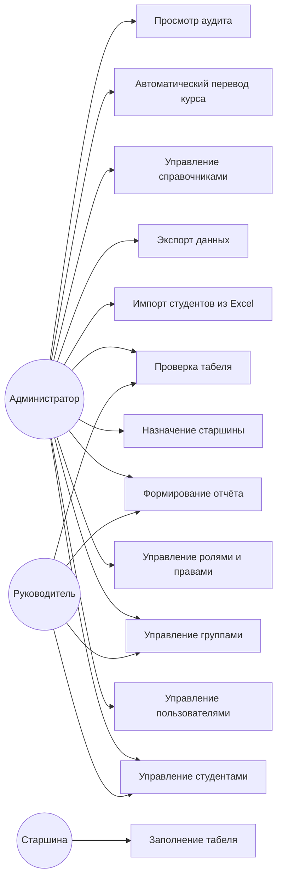
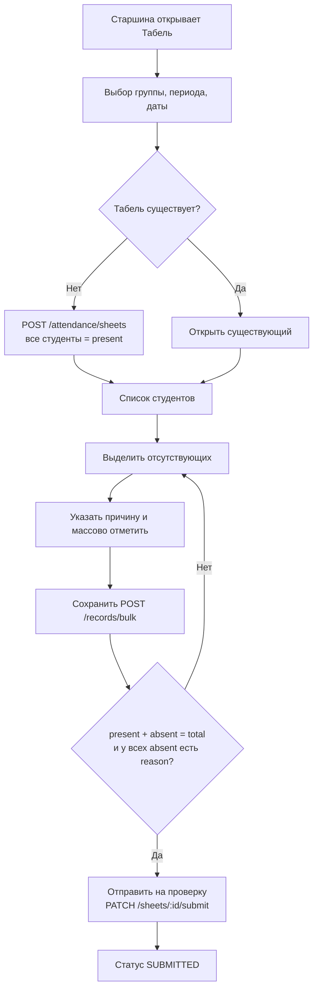
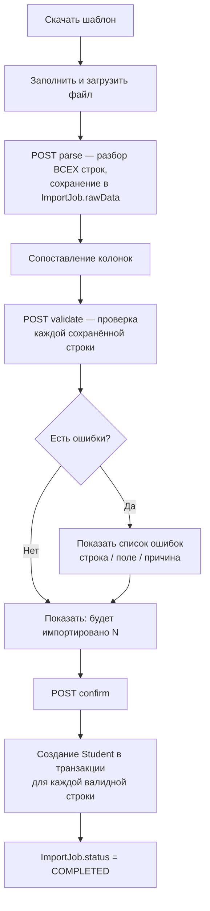
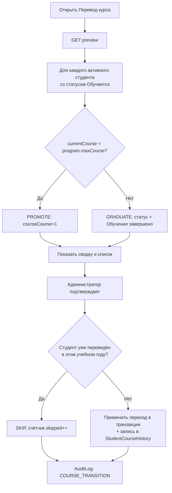
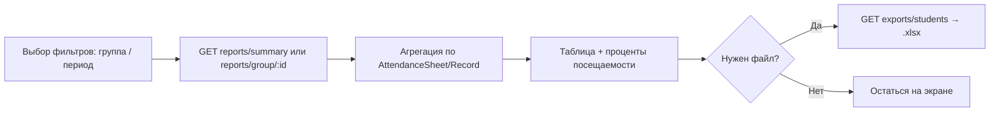

# Бизнес-процессы и Use Case

Все схемы и описания ниже отражают то, как процессы реализованы в коде (см. ссылки на файлы в `03-functionality-and-business-logic.md`), а не идеализированную версию.

## Actors

- **Администратор** — полный доступ
- **Руководитель / куратор** — доступ к направлениям
- **Старшина** — доступ к назначенным группам

## Диаграмма Use Case

## Use Case: Заполнение табеля

| | |
|---|---|
| **Actor** | Старшина |
| **Предусловия** | Пользователь авторизован, имеет `ATTENDANCE_WRITE` и `UserGroupScope` на группу |
| **Основной сценарий** | 1. Открывает «Табель» → 2. Выбирает группу/период/дату → 3. Система находит существующий табель или создаёт новый (все студенты помечены присутствующими) → 4. Выделяет отсутствующих (чекбоксы, «выбрать всех», поиск) → 5. Массово отмечает отсутствующими с указанием причины → 6. Система валидирует полноту → 7. «Отправить на проверку» |
| **Альтернативный сценарий** | На шаге 6 не все студенты отмечены или у кого-то из отсутствующих нет причины → кнопка отправки заблокирована, показано, сколько именно не хватает |
| **Постусловия** | Статус табеля — `SUBMITTED`, запись в `AuditLog` |
| **Бизнес-правила** | Один табель на комбинацию (группа, период, дата) — повторное создание отклоняется; закрытый табель недоступен для правки |

## Use Case: Импорт студентов из Excel

| | |
|---|---|
| **Actor** | Администратор |
| **Предусловия** | Файл заполнен по скачанному шаблону |
| **Основной сценарий** | 1. Скачивает шаблон → 2. Загружает файл → 3. Система распознаёт заголовки и все строки → 4. Сопоставляет колонки с полями системы → 5. Запускает проверку → 6. Просматривает результат (сколько импортируется, список ошибок) → 7. Подтверждает импорт |
| **Альтернативный сценарий** | Часть строк не проходит валидацию (несуществующая группа/программа/статус) — они не импортируются, но не блокируют импорт валидных строк; отчёт об ошибках показывает номер строки, поле и причину |
| **Постусловия** | Созданы записи `Student` (и `StudentGroupHistory`, если указана группа), `ImportJob.status = COMPLETED`, запись в `AuditLog` |
| **Бизнес-правило** | Число импортированных строк в точности равно числу прошедших валидацию — без исключений |

## Use Case: Автоматический перевод курса

| | |
|---|---|
| **Actor** | Администратор |
| **Предусловия** | Настроен текущий учебный год (`AcademicYear.isCurrent`), у студентов заполнены курс и программа |
| **Основной сценарий** | 1. Открывает «Перевод курса» → 2. Система строит предпросмотр (кто переходит, кто завершает обучение, кто пропущен) → 3. Администратор проверяет сводку → 4. Подтверждает выполнение |
| **Постусловия** | Обновлены `Student.currentCourse` / `Student.statusId`, добавлены записи в `StudentCourseHistory` (и `StudentStatusHistory` для выпускников), запись в `AuditLog` |
| **Бизнес-правило (идемпотентность)** | Повторный запуск `execute` в рамках того же учебного года не переводит уже переведённых студентов повторно — проверяется по наличию автоматической записи в `StudentCourseHistory` с начала текущего учебного года |

## Use Case: Формирование отчёта

| | |
|---|---|
| **Actor** | Администратор, руководитель |
| **Основной сценарий** | 1. Открывает «Отчёты» → 2. Выбирает вкладку (сводный / по группе) → 3. Для отчёта по группе — выбирает группу → 4. Система агрегирует данные по табелям за период → 5. При необходимости — «Экспорт студентов (.xlsx)» |
| **Постусловия** | Отчёт показан на экране; при экспорте — скачан файл `.xlsx` |

