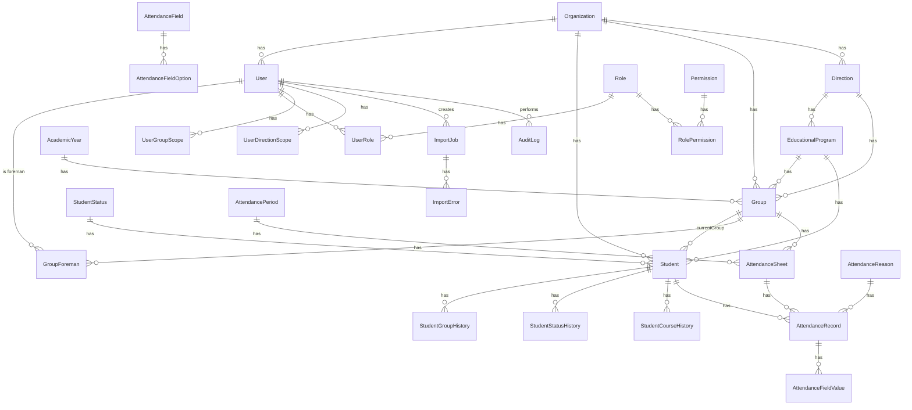

# База данных и API

## ER-модель (ключевые сущности и связи)



## Ключевые ограничения целостности

| Сущность | Ограничение | Зачем |
|---|---|---|
| `Student` | `@@unique([organizationId, internalId])` | Внутренний номер студента уникален в пределах организации, но допускает `null` (не обязателен) |
| `AttendanceSheet` | `@@unique([groupId, periodId, date])` | Нельзя создать два табеля на одну группу/период/дату — гарантия БД, а не только проверка в коде |
| `AttendanceRecord` | `@@unique([sheetId, studentId])` | Один студент — одна запись в табеле; повторная отметка делает `upsert`, а не дублирует строку |
| `AcademicYear` | `@@unique([organizationId, name])` | Нельзя создать два учебных года с одинаковым названием |
| `SystemSetting` | `@@unique([organizationId, key])` | Настройка организации — по сути key-value с уникальным ключом |
| `Role`/`Permission` | `@@id([roleId, permissionId])` (составной PK) | Связь роль↔право не может дублироваться |

Внешние ключи каскадно удаляют дочерние записи там, где это осмысленно (например, `AttendanceFieldOption.field`, `RolePermission.role/permission`) — но не для исторических таблиц студента: `Student.statusHistory` и т.п. используют `onDelete: Cascade` от студента, а не наоборот, то есть история не может пережить удаление своего студента, но и не блокирует ничего лишнего.

## Транзакции

Все составные мутации, где несколько таблиц должны измениться согласованно, обёрнуты в `prisma.$transaction`:

- Создание табеля + пред-заполнение записей присутствия (`AttendanceService.createSheet`)
- Массовое обновление записей посещаемости (`bulkUpdateRecords`)
- Назначение старосты: деактивация предыдущего + создание нового + выдача `UserGroupScope` (`GroupsService.assignForeman`)
- Автоматический перевод курса — отдельная транзакция **на каждого студента** (не одна на весь пакет), чтобы ошибка по одному студенту не откатывала уже обработанных остальных; ошибка ловится и попадает в список `errors` результата
- Импорт Excel — создание всех студентов из `confirm()` в одной транзакции
- Создание/обновление пользователя с ролями и scope (`UsersService.create/update`)

## Аутентификация и авторизация API

Все эндпоинты, кроме `POST /auth/login` и `POST /auth/refresh`, требуют заголовок `Authorization: Bearer <accessToken>`.

```
Guard-цепочка на защищённом маршруте:
  JwtAuthGuard   — валиден ли токен, не истёк ли
  RolesGuard     — если на маршруте есть @Roles(...), состоит ли пользователь в одной из ролей
  (внутри сервиса) — дополнительная фильтрация по scope (группа/направление)
```

Пример ответа на отсутствие/невалидный токен: `401 Unauthorized`. Пример ответа на нехватку роли: `403 Forbidden` с сообщением `Недостаточно прав для выполнения операции`. Пример ответа на нарушение scope (например, старшина пытается создать табель для чужой группы): `403 Forbidden`, `Нет доступа к этой группе`.

## Основные эндпоинты

### Auth
| Метод | Путь | Доступ |
|---|---|---|
| POST | `/auth/login` | публичный |
| POST | `/auth/refresh` | публичный (по refresh-токену) |
| POST | `/auth/logout` | авторизован |
| POST | `/auth/change-password` | авторизован |
| GET | `/auth/profile` | авторизован |

**Пример:** `POST /auth/login`
```json
// запрос
{ "email": "admin@vifsin.ru", "password": "Admin123!" }

// ответ 200
{
  "accessToken": "eyJ...",
  "refreshToken": "3dbd2086-...",
  "user": {
    "id": "...", "email": "admin@vifsin.ru",
    "roles": ["admin"],
    "permissions": ["STUDENTS_READ", "STUDENTS_WRITE", "..."]
  }
}
```

### Студенты
| Метод | Путь | Доступ | Примечание |
|---|---|---|---|
| GET | `/students` | `STUDENTS_READ` | пагинация, поиск, фильтры; scope применяется автоматически |
| GET | `/students/:id` | `STUDENTS_READ` | |
| GET | `/students/:id/history` | `STUDENTS_READ` | статус/группа/курс |
| POST | `/students` | admin, manager | `organizationId` в теле игнорируется, подставляется из JWT |
| PATCH | `/students/:id` | admin, manager | |
| GET | `/students/course-transition/preview` | admin | только чтение |
| POST | `/students/course-transition/execute` | admin | идемпотентно в рамках учебного года |

### Табель
| Метод | Путь | Доступ |
|---|---|---|
| GET | `/attendance/sheets` | scope по группе |
| POST | `/attendance/sheets` | `ATTENDANCE_WRITE` + scope |
| GET | `/attendance/sheets/:id/validation` | — полнота заполнения |
| PATCH | `/attendance/records/:sheetId/:studentId` | требует `reasonId`, если `isPresent: false` |
| POST | `/attendance/records/bulk` | тот же принцип, массово |
| PATCH | `/attendance/sheets/:id/submit` | проверяет полноту и причины |
| PATCH | `/attendance/sheets/:id/review` | admin, manager |
| PATCH | `/attendance/sheets/:id/close` | admin |

**Ошибка валидации (пример):**
```json
// PATCH /attendance/sheets/:id/submit, когда 5 студентов не отмечены
{
  "statusCode": 400,
  "message": "Не все студенты отмечены. Отмечено: 25 из 30. Незаполнено: 5"
}
```

### Импорт
| Метод | Путь | Доступ |
|---|---|---|
| GET | `/imports/template` | admin — скачать `.xlsx`-шаблон |
| POST | `/imports/students/parse` | admin — `multipart/form-data`, поле `file` |
| POST | `/imports/students/mapping` | admin |
| POST | `/imports/students/validate` | admin — без тела кроме `jobId`, строки берутся из БД |
| POST | `/imports/students/confirm` | admin |

### Остальные модули

Полный список путей и HTTP-методов по каждому модулю см. в исходниках `backend/src/*/*.controller.ts` — они однотипны (`GET` список/один, `POST` создать, `PATCH` обновить) и приведены с примерами в `03-functionality-and-business-logic.md`.

## Журнал аудита: откуда берутся записи

`AuditLog` заполняется точечно из сервисов (не middleware-перехватчиком на все запросы подряд), в следующих местах:

- `StudentsService` — создание/обновление студента, смена группы/статуса
- `GroupsService` — создание группы, назначение старосты, архивирование
- `UsersService` — создание/обновление пользователя
- `AttendanceService` — создание табеля, отправка на проверку, закрытие
- `CourseTransitionService` — выполнение автоматического перевода
- `ImportsService` — подтверждение импорта

Каждая запись содержит `organizationId`, `userId` (кто сделал), `action`, `entityType`, `entityId`, и там, где осмысленно — `oldValue`/`newValue` в виде JSON.
